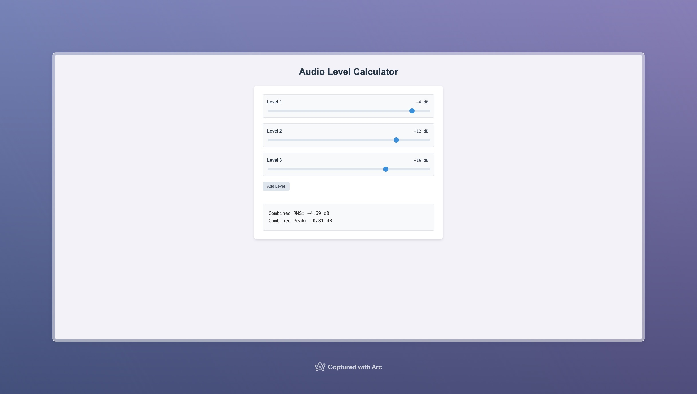

# Audio Level Calculator

A web-based tool for calculating combined audio levels in decibels (dB). This calculator helps audio engineers and enthusiasts determine the combined RMS and Peak levels when multiple audio signals are mixed together.



## Features

- Multiple audio level inputs with interactive sliders
- Real-time calculation of combined RMS and Peak levels
- Dynamic addition of new level inputs
- Clean and intuitive user interface
- Precise calculations using industry-standard formulas

## Technical Details

The calculator performs two main calculations:
- **Combined RMS (Root Mean Square)**: Calculates the true power average of multiple audio signals
- **Combined Peak**: Calculates the maximum possible peak assuming perfect phase alignment

## Getting Started

### Prerequisites

- Node.js (Latest LTS version recommended)
- npm or yarn

### Installation

1. Clone the repository
```bash
git clone https://github.com/yuichkun/audio-level-calculator.git
cd audio-level-calculator
```

2. Install dependencies
```bash
npm install
# or
yarn install
```

3. Start the development server
```bash
npm run dev
# or
yarn dev
```

4. Build for production
```bash
npm run build
# or
yarn build
```

## Usage

1. Adjust the level sliders to set your input audio levels
2. Click "Add Level" to add more input signals
3. View the combined RMS and Peak levels in real-time
4. Input values can be adjusted either using the slider or by directly typing in the dB value

## Built With

- TypeScript
- Vite
- Modern CSS

## License

This project is licensed under the MIT License - see the [LICENSE](LICENSE) file for details.

## Author

[@yuichkun](https://github.com/yuichkun) 